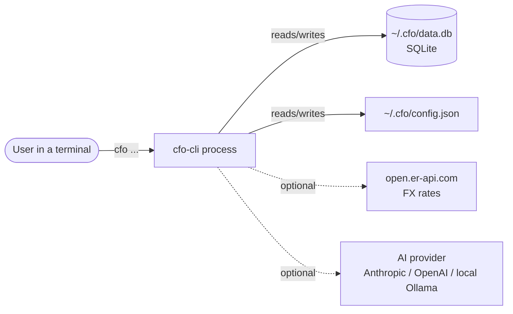
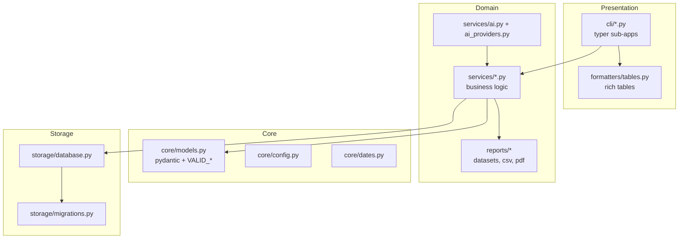
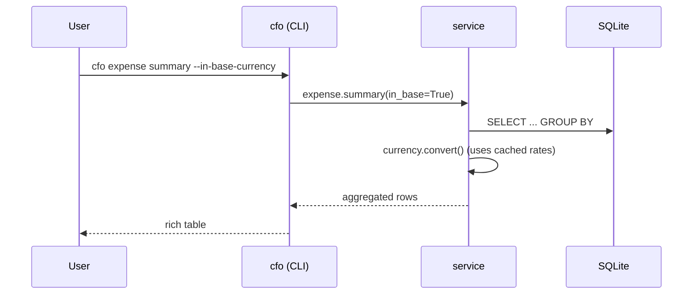

# System Design: cfo-cli

- **Status:** Living document (reflects v0.9)
- **Last updated:** 2026-06-01

> Engineering view of the system as a whole — components, communication, data
> growth, security and dependencies. The product view is the
> [PRD](../prd/PRD.md).

## 1. Context

cfo-cli is a **single-process, local-first command-line application**. There is
no server, no cloud, no multi-tenancy. Each invocation runs, reads/writes a local
SQLite database, renders output, and exits. "Production" is the end user's own
machine plus the supply chain that delivers the package to it.



## 2. Components

The codebase is layered; the CLI never touches the database directly.



| Layer | Responsibility | Rule |
|---|---|---|
| **CLI** (`cfo/cli/`) | Parse args, call a service, render result. One file per command group. | No DB logic here. |
| **Services** (`cfo/services/`) | All business logic and DB access; raise typed errors. | The CLI's only entry point to data. |
| **Reports** (`cfo/reports/`) | Normalise service data → CSV/PDF writers (reportlab lazy). | — |
| **Core** (`cfo/core/`) | Models/validation, config, date helpers. | — |
| **Storage** (`cfo/storage/`) | Connection, schema, numbered migrations. | Migrations are append-only. |

## 3. Communication

- **Within the process:** plain Python function calls, top to bottom (CLI →
  service → storage). No IPC, no message bus.
- **Database:** synchronous `sqlite3`, one connection per command, auto-applied
  migrations on `init_db()`.
- **Outbound HTTP (optional):**
  - **FX rates** via `httpx` to open.er-api.com — only on `currency` commands or
    `--in-base-currency`, cached 24h in the `exchange_rates` table.
  - **AI** via the Anthropic / OpenAI SDKs (lazy-imported). The `local` provider
    speaks the OpenAI protocol to a localhost Ollama server.



## 4. Data model

Base tables in `storage/database.py`; everything else via numbered migrations.

```mermaid
erDiagram
    budgets ||--o{ budget_lines : has
    budgets ||--o{ expenses : "may tag"
    income_sources ||--o{ income_entries : has
    forecast_scenarios ||--o{ forecast_adjustments : has
    budgets { int id PK; text name; text period }
    budget_lines { int id PK; int budget_id FK; text category; real amount; text currency }
    expenses { int id PK; int budget_id FK; text category; real amount; text currency; text date }
    income_sources { int id PK; text name; bool is_recurring; text recur_every }
    income_entries { int id PK; int source_id FK; real amount; text currency; text date }
    forecast_scenarios { int id PK; text name; text period_from; text period_to }
    forecast_adjustments { int id PK; int scenario_id FK; text type; real factor }
    exchange_rates { text base_currency PK; text quote_currency PK; real rate; text fetched_at }
```

## 5. "Scalability" — data growth, not servers

There are no concurrent users or request load to scale. The relevant axis is
**local data growth over years of use**:

- Workload is single-user and interactive; queries are simple aggregates.
- Indexes exist on the hot columns (`expenses(date, category, budget_id)`, migration 001).
- A solo operator generates thousands of rows/year — trivially within SQLite's
  comfort zone. No partitioning or archival is needed at the expected scale.
- The bound is the user's disk, and the whole dataset is one portable file.

## 6. Security & privacy

| Concern | Approach |
|---|---|
| **Data at rest** | Lives only in `~/.cfo/`, under the OS user's permissions. No transmission unless the user runs FX/AI commands. |
| **API keys** | Stored in `~/.cfo/config.json` (local). Never logged or sent anywhere except the corresponding provider. |
| **AI data minimization** | Only **aggregated** figures (totals/breakdowns) are sent — never individual transactions. The `local` provider keeps everything on-device. |
| **Supply chain** | Published to PyPI via **Trusted Publishing (OIDC)** — no long-lived token to leak. Releases are gated on CI. |
| **Third-party input** | FX API responses are validated (`result == success`) before use; failures fall back to cache. |
| **Dependencies** | Heavy/optional SDKs are lazy-imported and gated behind extras, shrinking the default attack surface. |

Threat model details and vulnerability reporting: [`../../SECURITY.md`](../../SECURITY.md).

## 7. Dependencies

| Dependency | Role | Failure mode / mitigation |
|---|---|---|
| `typer`, `rich` | CLI + rendering | Core; required. |
| `pydantic` | Models/validation | Core; required. |
| `httpx` | FX fetch | Network optional; 24h cache + offline fallback. |
| `reportlab` | PDF export | Lazy-imported; CSV works without it. |
| `anthropic` *(extra)* | Claude provider | Lazy; only if `[ai]` installed and selected. |
| `openai` *(extra)* | OpenAI + local provider | Lazy; only if `[openai]` installed. |
| open.er-api.com | FX rates source | External; cached, degrades gracefully offline. |
| Ollama runtime | Local AI | External, user-installed; optional. |

## 8. Cross-cutting decisions

The "why" behind this design is recorded as ADRs — see [`../adr/`](../adr/)
(local-first SQLite, layered service architecture, numbered migrations,
aggregated-only multi-provider AI, lazy SDK imports, PEP 639 + Trusted Publishing).
