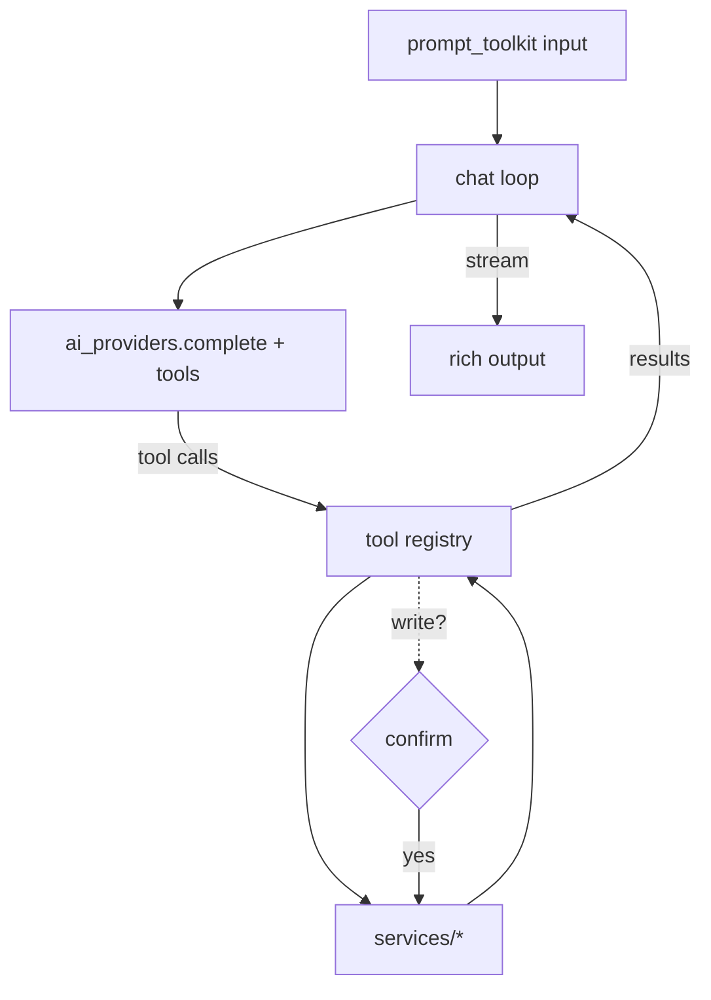

# TS-0001: Interactive AI console — Technical Specification

- **Status:** Draft
- **Author(s):** Xavier Potrony
- **Created:** 2026-06-01
- **Related:** [RFC-0001](../rfcs/RFC-0001-interactive-console.md), [ADR-0002](../adr/ADR-0002-layered-service-architecture.md), [ADR-0004](../adr/ADR-0004-multi-provider-aggregated-ai.md)

## Overview

Implements the `cfo chat` REPL proposed in RFC-0001: a persistent loop that turns
natural-language input into actions by letting the configured AI provider call
the existing services as tools. RFC-0001 decided *whether*; this spec covers
*how*.

## Requirements

**Functional**

- `cfo chat` opens an interactive session; `Ctrl-D`/`/exit` quits.
- The model can call **read tools** (e.g. `summarise_expenses`, `list_income`,
  `run_forecast`) freely.
- **Write tools** (`add_expense`, `create_budget`, `delete_*`) require an explicit
  `[y/N]` confirmation showing the exact action before it runs.
- In-console slash commands: `/help`, `/clear`, `/exit`, `/provider`.

**Non-functional**

- No raw bulk export to the model beyond a turn's tool results.
- Clean failure if the provider/key is missing (reuse `AIError`).
- Local-first preserved; offline works with the `local` provider (degraded).

## Design



The agent loop: send history + tool catalogue → receive tool calls → dispatch via
the registry (confirming writes) → append results → repeat until the model
returns a final message → stream it.

### Affected components

| Layer | File(s) | Change |
|---|---|---|
| CLI | `cfo/cli/chat.py` (new) | REPL wiring, slash commands, confirmation prompts. |
| Service | `cfo/services/agent.py` (new) | Tool registry, schema generation, agent loop. |
| Service | `cfo/services/ai_providers.py` | Extend `complete()` to pass tools / parse tool calls. |
| Core | `cfo/core/models.py` | Reuse pydantic models to emit tool JSON schemas. |

### Data model / schema changes

None expected (the console orchestrates existing services).

## API / CLI surface

```bash
cfo chat                     # start the session
# inside:
> how much did I spend on software in Q2?
> add a 49.99 software expense for Adobe         # → confirm [y/N]
> /provider local
> /exit
```

## Error handling & validation

- Missing provider/key → `AIError` with the existing actionable message.
- Tool dispatch validates args through the same pydantic models/`VALID_*` the
  services already use; invalid calls are returned to the model to retry.
- Writes never execute without confirmation.

## Testing plan

`tests/test_chat.py`, mocking the provider SDK and a scripted sequence of tool
calls (read-only and write-with-confirm). No live network. Cover: a read flow, a
write flow that is confirmed, a write flow that is declined, and a missing-key
error.

## Rollout & docs

- New dependency `prompt_toolkit` → add to `pyproject.toml` + Dependencies table.
- Version bump; CHANGELOG entry; README section; update CLAUDE.md structure.
- Phased delivery (per RFC-0001): REPL → read tools → write tools → memory/stream.

## Open questions

- Exact boundary of read-tool data access vs ADR-0004's aggregation stance.
- Whether to persist chat history across sessions.
